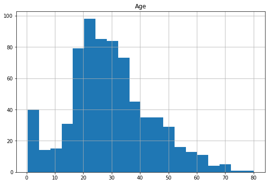
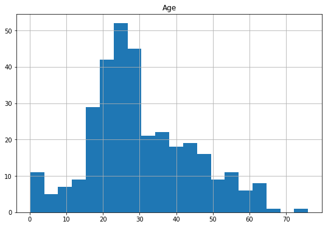
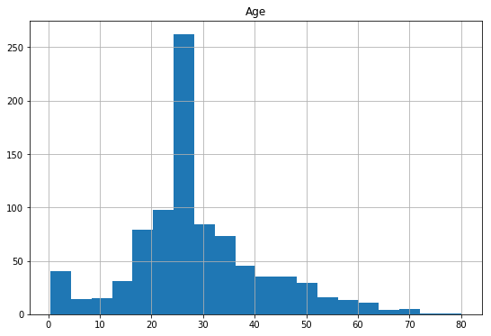
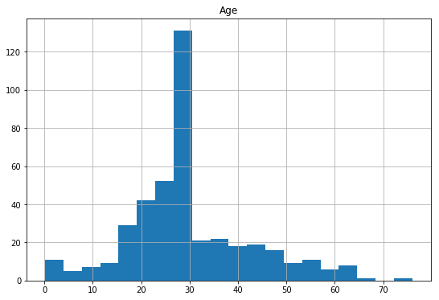
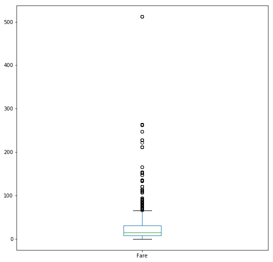
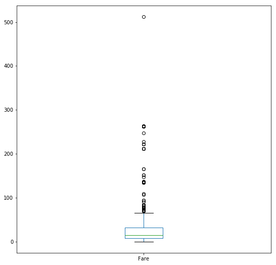
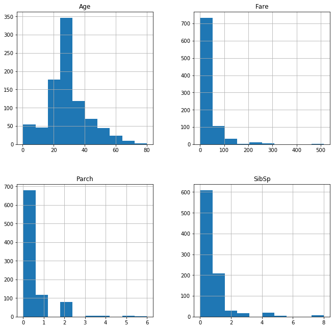
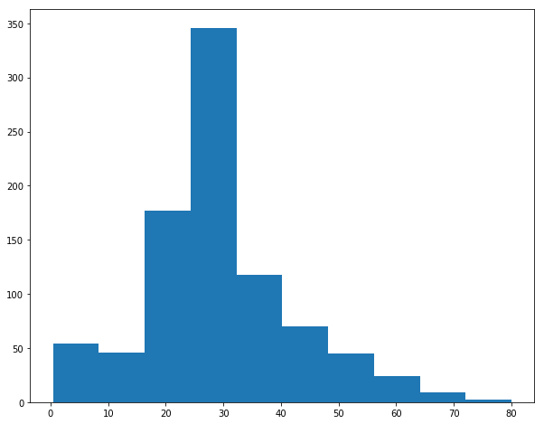

# Titanic Kaggle Challenge
The Titanic challenge on Kaggle is a competition in which the task is to predict the survival or the death of a given passenger based on a set of variables describing him such as his age, his sex, or his passenger class on the boat.


```python
#pandas
import pandas as pd
from pandas import Series,DataFrame

#numpy,matplotlib
import numpy as np
%matplotlib inline
import matplotlib.pyplot as plt
import os
pd.set_option('display.notebook_repr_html',False)
pd.set_option('display.max_columns',12)
pd.set_option('display.max_rows',12)
plt.style.use = 'default'

# machine learning
from sklearn.linear_model import LogisticRegression
from sklearn.tree import DecisionTreeClassifier
from sklearn.svm import SVC, LinearSVC
from sklearn.ensemble import RandomForestClassifier
from sklearn.ensemble import GradientBoostingClassifier
from sklearn.ensemble import ExtraTreesClassifier
from sklearn.ensemble import AdaBoostClassifier
from sklearn.neighbors import KNeighborsClassifier
from sklearn.naive_bayes import GaussianNB
import sklearn
```

## Reading and Exploring the data

http://hamelg.blogspot.in/2015/11/python-for-data-analysis-part-14.html
https://chrisalbon.com/#Kaggle


```python
os.chdir('C:\\Users\\SSKS\\Music\\kaggle\\kaggle-titanic\\data')
df=pd.read_csv('train.csv') ##index_col='PassengerId' can be used to apply it as index label in our dataframe
df_test=pd.read_csv('test.csv')
print(df.head(5))
print('-----------------------')
print(df_test.head(5))
```

       PassengerId  Survived  Pclass  \
    0            1         0       3   
    1            2         1       1   
    2            3         1       3   
    3            4         1       1   
    4            5         0       3   
    
                                                    Name     Sex   Age  SibSp  \
    0                            Braund, Mr. Owen Harris    male  22.0      1   
    1  Cumings, Mrs. John Bradley (Florence Briggs Th...  female  38.0      1   
    2                             Heikkinen, Miss. Laina  female  26.0      0   
    3       Futrelle, Mrs. Jacques Heath (Lily May Peel)  female  35.0      1   
    4                           Allen, Mr. William Henry    male  35.0      0   
    
       Parch            Ticket     Fare Cabin Embarked  
    0      0         A/5 21171   7.2500   NaN        S  
    1      0          PC 17599  71.2833   C85        C  
    2      0  STON/O2. 3101282   7.9250   NaN        S  
    3      0            113803  53.1000  C123        S  
    4      0            373450   8.0500   NaN        S  
    -----------------------
       PassengerId  Pclass                                          Name     Sex  \
    0          892       3                              Kelly, Mr. James    male   
    1          893       3              Wilkes, Mrs. James (Ellen Needs)  female   
    2          894       2                     Myles, Mr. Thomas Francis    male   
    3          895       3                              Wirz, Mr. Albert    male   
    4          896       3  Hirvonen, Mrs. Alexander (Helga E Lindqvist)  female   
    
        Age  SibSp  Parch   Ticket     Fare Cabin Embarked  
    0  34.5      0      0   330911   7.8292   NaN        Q  
    1  47.0      1      0   363272   7.0000   NaN        S  
    2  62.0      0      0   240276   9.6875   NaN        Q  
    3  27.0      0      0   315154   8.6625   NaN        S  
    4  22.0      1      1  3101298  12.2875   NaN        S  
    

The variables/features provided in the dataset are described below:-

PassengerId: id given to each traveler on the boat.
Pclass: the passenger class. It has three possible values: 1,2,3.
The Name
The Sex
The Age
SibSp: number of siblings and spouses traveling with the passenger
Parch: number of parents and children traveling with the passenger
The ticket number
The ticket Fare
The cabin number
The embarkation. It has three possible values S,C,Q


```python
df.describe()
```


           PassengerId    Survived      Pclass         Age       SibSp  \
    count   891.000000  891.000000  891.000000  714.000000  891.000000   
    mean    446.000000    0.383838    2.308642   29.699118    0.523008   
    std     257.353842    0.486592    0.836071   14.526497    1.102743   
    min       1.000000    0.000000    1.000000    0.420000    0.000000   
    25%     223.500000    0.000000    2.000000   20.125000    0.000000   
    50%     446.000000    0.000000    3.000000   28.000000    0.000000   
    75%     668.500000    1.000000    3.000000   38.000000    1.000000   
    max     891.000000    1.000000    3.000000   80.000000    8.000000   
    
                Parch        Fare  
    count  891.000000  891.000000  
    mean     0.381594   32.204208  
    std      0.806057   49.693429  
    min      0.000000    0.000000  
    25%      0.000000    7.910400  
    50%      0.000000   14.454200  
    75%      0.000000   31.000000  
    max      6.000000  512.329200  


```python
df_test.describe()
```


           PassengerId      Pclass         Age       SibSp       Parch        Fare
    count   418.000000  418.000000  332.000000  418.000000  418.000000  417.000000
    mean   1100.500000    2.265550   30.272590    0.447368    0.392344   35.627188
    std     120.810458    0.841838   14.181209    0.896760    0.981429   55.907576
    min     892.000000    1.000000    0.170000    0.000000    0.000000    0.000000
    25%     996.250000    1.000000   21.000000    0.000000    0.000000    7.895800
    50%    1100.500000    3.000000   27.000000    0.000000    0.000000   14.454200
    75%    1204.750000    3.000000   39.000000    1.000000    0.000000   31.500000
    max    1309.000000    3.000000   76.000000    8.000000    9.000000  512.329200


Non-numeric columns are dropped from the statistical summary provided by df.describe().Therefore for categorical variables we pass only those columns to the describe() method as shown below


```python
print(df.dtypes)
print('--------------------------------')
print(df.info())
```

    PassengerId      int64
    Survived         int64
    Pclass           int64
    Name            object
    Sex             object
    Age            float64
    SibSp            int64
    Parch            int64
    Ticket          object
    Fare           float64
    Cabin           object
    Embarked        object
    dtype: object
    --------------------------------
    <class 'pandas.core.frame.DataFrame'>
    RangeIndex: 891 entries, 0 to 890
    Data columns (total 12 columns):
    PassengerId    891 non-null int64
    Survived       891 non-null int64
    Pclass         891 non-null int64
    Name           891 non-null object
    Sex            891 non-null object
    Age            714 non-null float64
    SibSp          891 non-null int64
    Parch          891 non-null int64
    Ticket         891 non-null object
    Fare           891 non-null float64
    Cabin          204 non-null object
    Embarked       889 non-null object
    dtypes: float64(2), int64(5), object(5)
    memory usage: 66.2+ KB
    None
    


```python
categorical=df.columns[df.dtypes=='object']
print(categorical)
df[categorical].describe()
```

    Index(['Name', 'Sex', 'Ticket', 'Cabin', 'Embarked'], dtype='object')
    


                          Name   Sex  Ticket Cabin Embarked
    count                  891   891     891   204      889
    unique                 891     2     681   147        3
    top     Svensson, Mr. Olof  male  347082    G6        S
    freq                     1   577       7     4      644


```python
print('first 12 Cabin values\n\n',df['Cabin'][0:12])  
print('-------------------------------------------')
print('first 12 Ticket values\n\n',df['Ticket'][0:12])
```

    first 12 Cabin values
    
     0      NaN
    1      C85
    2      NaN
    3     C123
    4      NaN
    5      NaN
    6      E46
    7      NaN
    8      NaN
    9      NaN
    10      G6
    11    C103
    Name: Cabin, dtype: object
    -------------------------------------------
    first 12 Ticket values
    
     0            A/5 21171
    1             PC 17599
    2     STON/O2. 3101282
    3               113803
    4               373450
    5               330877
    6                17463
    7               349909
    8               347742
    9               237736
    10             PP 9549
    11              113783
    Name: Ticket, dtype: object
    

This shows the statistical summary of only the categorical variables in our dataset.As we can see the Variable 'Name' has unique values throughout and is not useful in our prediction analysis,therefore we can drop these values.

Furthermore the 'Cabin' variable has only 204 values present and a lot of missing values,so we could drop this column as well from the dataset(we could also fill value by fillna() method,but it is not useful in this case or as the names of the levels for the cabin variable seem to have a regular structure: each starts with a capital letter followed by a number. We could use that structure to reduce the number of levels to make categories large enough that they might be useful for prediction).So we keep the Cabin value in the dataset.

"PassengerId" is just a number assigned to each passenger. It is nothing more than an arbitrary identifier; we could keep it for identification purposes, but let's remove it anyway

"Ticket" has 680 unique values: almost as many as there are passengers. Categorical variables with almost as many levels as there are records are generally not very useful for prediction. We could try to reduce the number of levels by grouping certain tickets together, but the ticket numbers don't appear to follow any logical pattern we could use for grouping. Let's remove it:


```python
df=df.drop(['Ticket','PassengerId','Name'],axis=1)
df_test=df_test.drop(['Ticket','PassengerId','Name'],axis=1)
```

Now we have removed features which are not helpful in our prediction model.Next we will select,transform,impute/fill feature values by exploring the data

## Transform variables

A few variable which are categorical in nature have been encoded as integer types in the Python DataFrame such as "Survived" and "Pclass".

In case of Survived we could convert into Categorical value as below
pd.Categorical(df["Survived"]) but we wont be doing this as when submitting predictions for the competition, the predictions need to be encoded as 0 or 1.

But the "Pclass" seems to be encoded as integer that indicated a passenger class:-
1:First Class
2:Second Class
3:Third Class
These can be converted to Categorical variables as Passenger class is a category,furthermore 1st class would be considered "above" or "higher" than second class, but when encoded as an integer, 1 comes before 2. We can fix this by transforming Pclass into an ordered categorical variable:


```python
##Train data
new_Pclass=pd.Categorical(df['Pclass'],ordered=True)
new_Pclass=new_Pclass.rename_categories(['Class1','Class2','Class3'])
df['Pclass']=new_Pclass
print(new_Pclass.describe())
print('---------------------')
print(df['Pclass'].describe())
print('######################\n\n')
##Test data
new_Pclass=pd.Categorical(df_test['Pclass'],ordered=True)
new_Pclass=new_Pclass.rename_categories(['Class1','Class2','Class3'])
df_test['Pclass']=new_Pclass
print(new_Pclass.describe())
print('---------------------')
print(df_test['Pclass'].describe())

```

                counts     freqs
    categories                  
    Class1         216  0.242424
    Class2         184  0.206510
    Class3         491  0.551066
    ---------------------
    count        891
    unique         3
    top       Class3
    freq         491
    Name: Pclass, dtype: object
    ######################
    
    
                counts     freqs
    categories                  
    Class1         107  0.255981
    Class2          93  0.222488
    Class3         218  0.521531
    ---------------------
    count        418
    unique         3
    top       Class3
    freq         218
    Name: Pclass, dtype: object
    

Now lets look at "Cabin" variable,to check if we can combine the different levels based on first letter A,B,C,D.If we grouped cabin just by this letter, we could reduce the number of levels while extracting some useful information.


Refer:https://www.analyticsvidhya.com/blog/2015/11/easy-methods-deal-categorical-variables-predictive-modeling/


```python
##Train data
df["Cabin"].unique()
```


    array([nan, 'C85', 'C123', 'E46', 'G6', 'C103', 'D56', 'A6', 'C23 C25 C27',
           'B78', 'D33', 'B30', 'C52', 'B28', 'C83', 'F33', 'F G73', 'E31',
           'A5', 'D10 D12', 'D26', 'C110', 'B58 B60', 'E101', 'F E69', 'D47',
           'B86', 'F2', 'C2', 'E33', 'B19', 'A7', 'C49', 'F4', 'A32', 'B4',
           'B80', 'A31', 'D36', 'D15', 'C93', 'C78', 'D35', 'C87', 'B77',
           'E67', 'B94', 'C125', 'C99', 'C118', 'D7', 'A19', 'B49', 'D',
           'C22 C26', 'C106', 'C65', 'E36', 'C54', 'B57 B59 B63 B66', 'C7',
           'E34', 'C32', 'B18', 'C124', 'C91', 'E40', 'T', 'C128', 'D37',
           'B35', 'E50', 'C82', 'B96 B98', 'E10', 'E44', 'A34', 'C104', 'C111',
           'C92', 'E38', 'D21', 'E12', 'E63', 'A14', 'B37', 'C30', 'D20',
           'B79', 'E25', 'D46', 'B73', 'C95', 'B38', 'B39', 'B22', 'C86',
           'C70', 'A16', 'C101', 'C68', 'A10', 'E68', 'B41', 'A20', 'D19',
           'D50', 'D9', 'A23', 'B50', 'A26', 'D48', 'E58', 'C126', 'B71',
           'B51 B53 B55', 'D49', 'B5', 'B20', 'F G63', 'C62 C64', 'E24', 'C90',
           'C45', 'E8', 'B101', 'D45', 'C46', 'D30', 'E121', 'D11', 'E77',
           'F38', 'B3', 'D6', 'B82 B84', 'D17', 'A36', 'B102', 'B69', 'E49',
           'C47', 'D28', 'E17', 'A24', 'C50', 'B42', 'C148'], dtype=object)


```python
cabin_char=df['Cabin'].astype(str)
new_cabin=np.array([a[0] for a in cabin_char])
new_cabin=pd.Categorical(new_cabin)
new_cabin.describe()
```


                counts     freqs
    categories                  
    A               15  0.016835
    B               47  0.052750
    C               59  0.066218
    D               33  0.037037
    E               32  0.035915
    F               13  0.014590
    G                4  0.004489
    T                1  0.001122
    n              687  0.771044


```python
df['Cabin']=new_cabin
```


```python
###Test data
df_test["Cabin"].unique()
cabin_char=df_test['Cabin'].astype(str)
new_cabin=np.array([a[0] for a in cabin_char])
new_cabin=pd.Categorical(new_cabin)
new_cabin.describe()
df_test['Cabin']=new_cabin
```

### Finding and treating NA values,Outliers and strange values

EDA,plotting,treating Outliers and missing values
https://chrisalbon.com/python/pandas_missing_data.html
https://chartio.com/resources/tutorials/how-to-check-if-any-value-is-nan-in-a-pandas-dataframe
https://www.analyticsvidhya.com/blog/2016/01/guide-data-exploration
http://www.bogotobogo.com/python/scikit-learn/scikit_machine_learning_Data_Preprocessing-Missing-Data-Categorical-Data.php

Data sets are often littered with missing data, extreme data points called outliers and other strange values. Missing values, outliers and strange values can negatively affect statistical tests and models and may even cause certain functions to fail.


```python
df.isnull().sum()
```


    Survived      0
    Pclass        0
    Sex           0
    Age         177
    SibSp         0
    Parch         0
    Fare          0
    Cabin         0
    Embarked      2
    dtype: int64


Detecting missing values is the easy part: it is far more difficult to decide how to handle them. In cases where you have a lot of data and only a few missing values, it might make sense to simply delete records with missing values present. On the other hand, if you have more than a handful of missing values, removing records with missing values could cause you to get rid of a lot of data. Missing values in categorical data are not particularly troubling because you can simply treat NA as an additional category. Missing values in numeric variables are more troublesome, since you can't just treat a missing value as number. As it happens, the Titanic dataset has some NA's in the Age variable:


```python
df['Age'].describe()
```


    count    714.000000
    mean      29.699118
    std       14.526497
    min        0.420000
    25%       20.125000
    50%       28.000000
    75%       38.000000
    max       80.000000
    Name: Age, dtype: float64


```python
np.where(df['Age'].isnull()==True)
```


    (array([  5,  17,  19,  26,  28,  29,  31,  32,  36,  42,  45,  46,  47,
             48,  55,  64,  65,  76,  77,  82,  87,  95, 101, 107, 109, 121,
            126, 128, 140, 154, 158, 159, 166, 168, 176, 180, 181, 185, 186,
            196, 198, 201, 214, 223, 229, 235, 240, 241, 250, 256, 260, 264,
            270, 274, 277, 284, 295, 298, 300, 301, 303, 304, 306, 324, 330,
            334, 335, 347, 351, 354, 358, 359, 364, 367, 368, 375, 384, 388,
            409, 410, 411, 413, 415, 420, 425, 428, 431, 444, 451, 454, 457,
            459, 464, 466, 468, 470, 475, 481, 485, 490, 495, 497, 502, 507,
            511, 517, 522, 524, 527, 531, 533, 538, 547, 552, 557, 560, 563,
            564, 568, 573, 578, 584, 589, 593, 596, 598, 601, 602, 611, 612,
            613, 629, 633, 639, 643, 648, 650, 653, 656, 667, 669, 674, 680,
            692, 697, 709, 711, 718, 727, 732, 738, 739, 740, 760, 766, 768,
            773, 776, 778, 783, 790, 792, 793, 815, 825, 826, 828, 832, 837,
            839, 846, 849, 859, 863, 868, 878, 888], dtype=int32),)


714 values count of age is much lesser than the total count of values 891,indicating a case of missing data.We could fill the values with mean/median but it is much safer to do some visualization to identify the distribution of the values and later decide how to treat the missing values.

Here are a few ways we could deal with them:
Replace the null values with 0s
Replace the null values with some central value like the mean or median
Impute values (estimate values using statistical/predictive modeling methods.).
Split the data set into two parts: one set with where records have an Age value and another set where age is null.


```python
df.hist(column='Age',
       figsize=(9,6),
       bins=20)
```


    array([[<matplotlib.axes._subplots.AxesSubplot object at 0x07830CB0>]], dtype=object)





On plotting the histogram for the 'Age' variable we are able to see it is slightly right skewed and therefore we can use the median value 20-30 to fill the missing values


```python
###Test data
df_test['Age'].isnull().sum()
```


    86


```python
df_test.hist(column='Age',
           figsize=(9,6),
            bins=20)
```


    array([[<matplotlib.axes._subplots.AxesSubplot object at 0x07830CF0>]], dtype=object)





```python
df['Age'].fillna(df['Age'].median(),inplace=True)
df_test['Age'].fillna(df_test['Age'].median(),inplace=True)
```


```python
df['Age'].describe()
```


    count    891.000000
    mean      29.361582
    std       13.019697
    min        0.420000
    25%       22.000000
    50%       28.000000
    75%       35.000000
    max       80.000000
    Name: Age, dtype: float64


Now lets look at the histogram after filling median values for just a sanity check and its distribution.


```python
df.hist(column='Age',
       figsize=(9,6),
       bins=20)
```


    array([[<matplotlib.axes._subplots.AxesSubplot object at 0x0794DCB0>]], dtype=object)





```python
df_test.hist(column='Age',
       figsize=(9,6),
       bins=20)
```


    array([[<matplotlib.axes._subplots.AxesSubplot object at 0x079E8290>]], dtype=object)





Filling the missing values with median is better than deleting entire rows with missing values, even though the median value 28 might be off the actual values.In practice imputing the missing data (estimating age based on other variables) might have been a better option, but we'll stick with this for now.

Outliers

Outliers are extreme numerical values: values that lie far away from the typical values a variable takes on. Creating plots is one of the quickest ways to detect outliers. For instance, the histogram above shows that 1 or 2 passengers were near age 80. Ages near 80 are uncommon for this data set, but in looking at the general shape of the data seeing one or two 80 year olds doesn't seem particularly surprising.
Now let's investigate the "Fare" variable. This time we'll use a boxplot, since boxplots are designed to show the spread of the data and help identify outliers:


```python
df['Fare'].plot(kind='box',
               figsize=(9,9))
```


    <matplotlib.axes._subplots.AxesSubplot at 0x7b9af90>





```python
df_test['Fare'].plot(kind='box',
               figsize=(9,9))
```


    <matplotlib.axes._subplots.AxesSubplot at 0x7bcadd0>





In a boxplot, the central box represents 50% of the data and the central bar represents the median. The dotted lines with bars on the ends are "whiskers" which encompass the great majority of the data and points beyond the whiskers indicate uncommon values. In this case, we have some uncommon values that are so far away from the typical value that the box appears squashed in the plot: this is a clear indication of outliers. Indeed, it looks like one passenger paid almost twice as much as any other passenger. Even the passengers that paid between 200 and 300 are far higher than the vast majority of the other passengers.
For interest's sake, let's check the name of this high roller:


```python
maxfare=np.where(df['Fare']==max(df['Fare']))
df.loc[maxfare]
```


         Survived  Pclass     Sex   Age  SibSp  Parch      Fare Cabin Embarked
    258         1  Class1  female  35.0      0      0  512.3292     n        C
    679         1  Class1    male  36.0      0      1  512.3292     B        C
    737         1  Class1    male  35.0      0      0  512.3292     B        C


In the graph there appears to be one passenger who paid more than all the others, but the output above shows that there were actually three passengers who all paid the same high fare.
Similar to NA values, there's no single cure for outliers. You can keep them, delete them or transform them in some way to try to reduce their impact. Even if you decide to keep outliers unchanged it is still worth identifying them since they can have disproportionately large influence on your results. Let's keep the three high rollers unchanged.
Data sets can have other strange values beyond missing values and outliers that you may need to address. Sometimes data is mislabeled or simply erroneous; bad data can corrupt any sort of analysis so it is important to address these sorts of issues before doing too much work.


Creating new variables:

The variables present when you load a data set aren't always the most useful variables for analysis. Creating new variables that are derivations or combinations existing ones is a common step to take before jumping into an analysis or modeling task.
For example, imagine you are analyzing web site auctions where one of the data fields is a text description of the item being sold. A raw block of text is difficult to use in any sort of analysis, but you could create new variables from it such as a variable storing the length of the description or variables indicating the presence of certain keywords.
Creating a new variable can be as simple as taking one variable and adding, multiplying or dividing by another. Let's create a new variable, Family, that combines SibSp and Parch to indicate the total number of family members (siblings, spouses, parents and children) a passenger has on board:


```python
df.isnull().sum()
```


    Survived    0
    Pclass      0
    Sex         0
    Age         0
    SibSp       0
    Parch       0
    Fare        0
    Cabin       0
    Embarked    2
    dtype: int64


```python
df_test.isnull().sum()
```


    Pclass      0
    Sex         0
    Age         0
    SibSp       0
    Parch       0
    Fare        1
    Cabin       0
    Embarked    0
    dtype: int64


```python
nofare=np.where(df_test['Fare'].isnull()==True)
df_test.loc[nofare]
```


         Pclass   Sex   Age  SibSp  Parch  Fare Cabin Embarked
    152  Class3  male  60.5      0      0   NaN     n        S


```python
df_test['Fare'].fillna(df_test.groupby('Pclass')['Fare'].transform('mean'),inplace=True)###filling NA value with mean of fare grouped by Pclass
df_test.isnull().sum()
```


    Pclass      0
    Sex         0
    Age         0
    SibSp       0
    Parch       0
    Fare        0
    Cabin       0
    Embarked    0
    dtype: int64


```python
df['Embarked'].describe()
```


    count     889
    unique      3
    top         S
    freq      644
    Name: Embarked, dtype: object


```python
###Filling missing embarked values with most frequently occuring value --'S'
df['Embarked']=np.where(df['Embarked'].isnull(),
               'S',
               df['Embarked'])

```


```python
df['Embarked'].describe()
```


    count     891
    unique      3
    top         S
    freq      646
    Name: Embarked, dtype: object


```python
df.isnull().sum()
```


    Survived    0
    Pclass      0
    Sex         0
    Age         0
    SibSp       0
    Parch       0
    Fare        0
    Cabin       0
    Embarked    0
    dtype: int64


```python
df.info()
```

    <class 'pandas.core.frame.DataFrame'>
    RangeIndex: 891 entries, 0 to 890
    Data columns (total 9 columns):
    Survived    891 non-null int64
    Pclass      891 non-null category
    Sex         891 non-null object
    Age         891 non-null float64
    SibSp       891 non-null int64
    Parch       891 non-null int64
    Fare        891 non-null float64
    Cabin       891 non-null category
    Embarked    891 non-null object
    dtypes: category(2), float64(2), int64(3), object(2)
    memory usage: 43.6+ KB
    


```python
df.describe()
```


             Survived         Age       SibSp       Parch        Fare
    count  891.000000  891.000000  891.000000  891.000000  891.000000
    mean     0.383838   29.361582    0.523008    0.381594   32.204208
    std      0.486592   13.019697    1.102743    0.806057   49.693429
    min      0.000000    0.420000    0.000000    0.000000    0.000000
    25%      0.000000   22.000000    0.000000    0.000000    7.910400
    50%      0.000000   28.000000    0.000000    0.000000   14.454200
    75%      1.000000   35.000000    1.000000    0.000000   31.000000
    max      1.000000   80.000000    8.000000    6.000000  512.329200


```python
df_test.info()
```

    <class 'pandas.core.frame.DataFrame'>
    RangeIndex: 418 entries, 0 to 417
    Data columns (total 8 columns):
    Pclass      418 non-null category
    Sex         418 non-null object
    Age         418 non-null float64
    SibSp       418 non-null int64
    Parch       418 non-null int64
    Fare        418 non-null float64
    Cabin       418 non-null category
    Embarked    418 non-null object
    dtypes: category(2), float64(2), int64(2), object(2)
    memory usage: 17.2+ KB
    


```python
#category=['Pclass','Sex','Cabin','Embarked']
#from sklearn.preprocessing import LabelEncoder
#lbl_enc=LabelEncoder()
#for label in category:
#    df[label]=lbl_enc.fit_transform(df[label])
```


```python
#df[category].describe()
```


```python
df.info()
```

    <class 'pandas.core.frame.DataFrame'>
    RangeIndex: 891 entries, 0 to 890
    Data columns (total 9 columns):
    Survived    891 non-null int64
    Pclass      891 non-null category
    Sex         891 non-null object
    Age         891 non-null float64
    SibSp       891 non-null int64
    Parch       891 non-null int64
    Fare        891 non-null float64
    Cabin       891 non-null category
    Embarked    891 non-null object
    dtypes: category(2), float64(2), int64(3), object(2)
    memory usage: 43.6+ KB
    

## Dealing with Categorical variables

There are some cases where LabelEncoder or DictVectorizor are useful, but these are quite limited in my opinion due to ordinality.

LabelEncoder can turn [dog,cat,dog,mouse,cat] into [1,2,1,3,2], but then the imposed ordinality means that the average of dog and mouse is cat. Still there are algorithms like decision trees and random forests that can work with categorical variables just fine and LabelEncoder can be used to store values using less disk space.

One-Hot-Encoding has a the advantage that the result is binary rather than ordinal and that everything sits in an orthogonal vector space. The disadvantage is that for high cardinality, the feature space can really blow up quickly and you start fighting with the curse of dimensionality. In these cases, I typically employ one-hot-encoding followed by PCA for dimensionality reduction. I find that the judicious combination of one-hot plus PCA can seldom be beat by other encoding schemes. PCA finds the linear overlap, so will naturally tend to group similar features into the same feature.

Many a times, you have a machine learning problem with a data set where you have one ore more categorical features/columns. Now, there are generally three parts to a machine learning problem, prepare/clean the data, do feature selection, fit models and predict.

In feature selection phase, if you plan to use things like chi square, variance (note if you have extremely skewed data set, say with 95% false/0 target values and 5% true/>0 target values, a very low variance feature might also be an important feature), L1/Lasso regularized Logistic Regression or Support Vector (with Linear Kernel), Principal component analysis etc, you will need to convert your categorical values to one/against all in each column. If you have only categorical values, or a mixture, and your target is a class, and you are using trees, information gain etc to do the feature selection phase, then you will not need this conversion.

Similarly in the fit models and predict phase, if you are using any algorithm other than trees/clustering where your feature values will be multiplied by co-efficients, then you will need to covert your categorical values into one/against all in each column. It is possible though that the library you are using in R or Matlab or Python or R or SPSS, may already have this option inbuilt. So, do check before doing the conversion yourself.

If you need to do the conversion, this is how you do it in Python using OneHotEncoder, LabelEncoder

http://www.bogotobogo.com/python/scikit-learn/scikit_machine_learning_Data_Preprocessing-Missing-Data-Categorical-Data.php


```python
type(df['Pclass'])
```


    pandas.core.series.Series


```python
##Label Encoder

label_encoder = sklearn.preprocessing.LabelEncoder()
category=['Pclass','Sex','Cabin','Embarked']
for col in category:
    data_label_encoded_train = label_encoder.fit_transform(df[col])
    df[col] = data_label_encoded_train
    
    data_label_encoded_test = label_encoder.fit_transform(df_test[col])
    df_test[col] = data_label_encoded_test
#data_feature_one_hot_encoded = encoder.fit_transform(df[['Pclass']].as_matrix())


```


```python
##One Hot Encoder
from sklearn.preprocessing import OneHotEncoder
enc=OneHotEncoder(sparse=False)
df_train1=df
df_test1=df_test
category=['Pclass','Sex','Cabin','Embarked']
for col in category:
    # creating an exhaustive list of all possible categorical values
    data=df[[col]].append(df_test[[col]])
    enc.fit(data)
    # Fitting One Hot Encoding on train data
    temp = enc.transform(df[[col]])
    # Changing the encoded features into a data frame with new column names
    temp=pd.DataFrame(temp,columns=[(col+"_"+str(i)) for i in data[col].value_counts().index])
    # In side by side concatenation index values should be same
    # Setting the index values similar to the X_train data frame
    temp=temp.set_index(df.index.values)
    # adding the new One Hot Encoded varibales to the train data frame
    df_train1=pd.concat([df_train1,temp],axis=1)
    # fitting One Hot Encoding on test data
    temp = enc.transform(df_test[[col]])
    # changing it into data frame and adding column names
    temp=pd.DataFrame(temp,columns=[(col+"_"+str(i)) for i in data[col].value_counts().index])
    # Setting the index for proper concatenation
    temp=temp.set_index(df_test.index.values)
    # adding the new One Hot Encoded varibales to test data frame
    df_test1=pd.concat([df_test1,temp],axis=1)
```


```python
df_train1['Cabin']
```


    0      8
    1      2
    2      8
    3      2
    4      8
    5      8
          ..
    885    8
    886    8
    887    1
    888    8
    889    2
    890    8
    Name: Cabin, dtype: int32


```python
df_train1.info()
```

    <class 'pandas.core.frame.DataFrame'>
    RangeIndex: 891 entries, 0 to 890
    Data columns (total 26 columns):
    Survived      891 non-null int64
    Pclass        891 non-null int32
    Sex           891 non-null int32
    Age           891 non-null float64
    SibSp         891 non-null int64
    Parch         891 non-null int64
    Fare          891 non-null float64
    Cabin         891 non-null int32
    Embarked      891 non-null int32
    Pclass_2      891 non-null float64
    Pclass_0      891 non-null float64
    Pclass_1      891 non-null float64
    Sex_1         891 non-null float64
    Sex_0         891 non-null float64
    Cabin_8       891 non-null float64
    Cabin_7       891 non-null float64
    Cabin_2       891 non-null float64
    Cabin_1       891 non-null float64
    Cabin_3       891 non-null float64
    Cabin_4       891 non-null float64
    Cabin_0       891 non-null float64
    Cabin_5       891 non-null float64
    Cabin_6       891 non-null float64
    Embarked_2    891 non-null float64
    Embarked_0    891 non-null float64
    Embarked_1    891 non-null float64
    dtypes: float64(19), int32(4), int64(3)
    memory usage: 167.1 KB
    


```python
df_train=df_train1.drop(['Sex','Cabin','Embarked','Pclass'],axis=1)
df_test=df_test1.drop(['Sex','Cabin','Embarked','Pclass'],axis=1)
```


```python
df_train.info()
```

    <class 'pandas.core.frame.DataFrame'>
    RangeIndex: 891 entries, 0 to 890
    Data columns (total 22 columns):
    Survived      891 non-null int64
    Age           891 non-null float64
    SibSp         891 non-null int64
    Parch         891 non-null int64
    Fare          891 non-null float64
    Pclass_2      891 non-null float64
    Pclass_0      891 non-null float64
    Pclass_1      891 non-null float64
    Sex_1         891 non-null float64
    Sex_0         891 non-null float64
    Cabin_8       891 non-null float64
    Cabin_7       891 non-null float64
    Cabin_2       891 non-null float64
    Cabin_1       891 non-null float64
    Cabin_3       891 non-null float64
    Cabin_4       891 non-null float64
    Cabin_0       891 non-null float64
    Cabin_5       891 non-null float64
    Cabin_6       891 non-null float64
    Embarked_2    891 non-null float64
    Embarked_0    891 non-null float64
    Embarked_1    891 non-null float64
    dtypes: float64(19), int64(3)
    memory usage: 153.2 KB
    

## Feature Scaling and Feature Standardization

https://www.analyticsvidhya.com/blog/2015/11/8-ways-deal-continuous-variables-predictive-modeling/


```python
df_train[['Age','SibSp','Parch','Fare']].hist(figsize =[11,11])
```


    array([[<matplotlib.axes._subplots.AxesSubplot object at 0x07C305B0>,
            <matplotlib.axes._subplots.AxesSubplot object at 0x080D1AF0>],
           [<matplotlib.axes._subplots.AxesSubplot object at 0x0810C370>,
            <matplotlib.axes._subplots.AxesSubplot object at 0x081485D0>]], dtype=object)





As we can see the continuous variable features are not having the same range of values and are not properly scaled,it is very important to implement feature scaling to improve the performance of the model.

But before putting your raw data into the model, it’s important that it’s in the right format. This means ensuring that your predictor variables are numerical and properly scaled.

Scaling methods

Standard scale

Features can be scaled to have mean 0 and variance 1, which is also known as calculating Z-scores for every observation. This will usually transform the data so that most of your data falls between [-3, 3].

Min-max scale

Another way of scaling is to subtract each value by the minimum value and divide by the range. This is called min-max scaling and it transforms your feature to a scale of [0, 1]. For better or worse, this scaling technique does not change the distribution of your data.

http://pythonhow.com/accessing-dataframe-columns-rows-and-cells


```python
X=df_train.values
Y=df_train['Survived'].values
#X has still Survived values in it, which should not be there. So we drop in numpy column which is the 1st column.
X=np.delete(X,0,axis=1)
X_tst=df_test.values

```


```python
plt.figure(figsize=(10,8))
plt.hist(X[:,0])
np.var(X[:,0])
```


    169.32224856193815





```python
std_scalar = sklearn.preprocessing.StandardScaler()
std_scalar.fit(X)
X_train_std = std_scalar.transform(X)
Kaggle_test_std = std_scalar.transform(X_tst)
```


```python
mean_vec=np.mean(X_train_std,axis=0)
print(mean_vec)###these values are close to zero

var_vec=np.var(X_train_std,axis=0)
var_vec## has unit variance after standardization
```

    [  2.27277979e-16   4.38606627e-17   5.38289951e-17   3.98733297e-18
      -7.57593265e-17   1.99366649e-17  -6.77846605e-17   3.98733297e-17
      -1.15632656e-16   5.98099946e-18   4.38606627e-17  -6.77846605e-17
      -2.99049973e-17  -4.98416622e-17  -1.99366649e-18   3.98733297e-18
       0.00000000e+00  -9.56959913e-17  -1.99366649e-17   0.00000000e+00
      -8.37339924e-17]
    


    array([ 1.,  1.,  1.,  1.,  1.,  1.,  1.,  1.,  1.,  1.,  1.,  1.,  1.,
            1.,  1.,  1.,  1.,  1.,  1.,  1.,  1.])


```python

```


```python
from sklearn import cross_validation
X_train, X_test, y_train, y_test = cross_validation.train_test_split(X_train_std,Y,test_size=0.3,random_state=0)
```

    D:\Windows.old\Users\Public\Documents\programs\lib\site-packages\sklearn\cross_validation.py:44: DeprecationWarning: This module was deprecated in version 0.18 in favor of the model_selection module into which all the refactored classes and functions are moved. Also note that the interface of the new CV iterators are different from that of this module. This module will be removed in 0.20.
      "This module will be removed in 0.20.", DeprecationWarning)
    


```python
print('Class label frequencies')

print('\nTraining Dataset:')    
for l in range(0,2):
    print('Class {:} samples: {:.2%}'.format(l, list(y_train).count(l)/y_train.shape[0]))

print('\nTest Dataset:')     
for l in range(0,2):
    print('Class {:} samples: {:.2%}'.format(l, list(y_test).count(l)/y_test.shape[0]))
```

    Class label frequencies
    
    Training Dataset:
    Class 0 samples: 61.16%
    Class 1 samples: 38.84%
    
    Test Dataset:
    Class 0 samples: 62.69%
    Class 1 samples: 37.31%
    

As we can see after the train test split of our data,the class label frequencies are equally distributed in equal proportion across the train/test split which is whats expected - balanced class distribution in both.


Feature selection http://machinelearningmastery.com/feature-selection-machine-learning-python/

## Model Building

### 1) simple Decision Tree Classifier machine learning algorithm

http://dni-institute.in/blogs/decision-tree-entropy-and-information-gain/
https://www.analyticsvidhya.com/blog/2016/04/complete-tutorial-tree-based-modeling-scratch-in-python/


```python
clf1=DecisionTreeClassifier(max_depth=5)
clf1.fit(X_train,y_train)
clf1.score(X_test,y_test)
```


    0.82089552238805974


Not bad it gives score of 81.34%.Decision trees compute entropy in the information system. If you peform a decision tree on dataset, the variable importances_ contains important information on what columns of data has large variances thus contributing to the decision. Lets see the output.We can see 9th element 0.53 indicating Sex_0 which is female class having 53% importance in deciding target class as well as 1st element age having 12% importance


```python
clf1.feature_importances_
```


    array([ 0.13744537,  0.04472946,  0.00938927,  0.07390082,  0.00629757,
            0.        ,  0.11238557,  0.        ,  0.53247143,  0.        ,
            0.        ,  0.        ,  0.        ,  0.01524026,  0.        ,
            0.        ,  0.        ,  0.05036617,  0.        ,  0.        ,
            0.01777407])


```python
df_train.columns[1:]
```


    Index(['Age', 'SibSp', 'Parch', 'Fare', 'Pclass_2', 'Pclass_0', 'Pclass_1',
           'Sex_1', 'Sex_0', 'Cabin_8', 'Cabin_7', 'Cabin_2', 'Cabin_1', 'Cabin_3',
           'Cabin_4', 'Cabin_0', 'Cabin_5', 'Cabin_6', 'Embarked_2', 'Embarked_0',
           'Embarked_1'],
          dtype='object')


## 2) RandomForestClassifier

using GridSearchCV to tune and select the hyperparameters of model

conduct the grid search using scikit-learn's GridSearchCV which stands for grid search cross validation. By default, the GridSearchCV's cross validation uses 3-fold KFold or StratifiedKFold depending on the situation.

http://blog.datadive.net/selecting-good-features-part-iii-random-forests/
https://www.analyticsvidhya.com/blog/2014/06/introduction-random-forest-simplified/


```python

from sklearn.model_selection import GridSearchCV 
param_grid = {'n_estimators': range(100,500,100), 'max_features': ['sqrt','log2'],'min_samples_leaf':range(20,80,20)}

clf2=RandomForestClassifier(random_state=1)
#clf.fit(X_train,y_train)
#clf.score(X_test,y_test)

model=GridSearchCV(estimator=clf2,param_grid=param_grid,n_jobs=10,cv=10)
model.fit(X_train,y_train)
```


    GridSearchCV(cv=10, error_score='raise',
           estimator=RandomForestClassifier(bootstrap=True, class_weight=None, criterion='gini',
                max_depth=None, max_features='auto', max_leaf_nodes=None,
                min_impurity_split=1e-07, min_samples_leaf=1,
                min_samples_split=2, min_weight_fraction_leaf=0.0,
                n_estimators=10, n_jobs=1, oob_score=False, random_state=1,
                verbose=0, warm_start=False),
           fit_params={}, iid=True, n_jobs=10,
           param_grid={'n_estimators': range(100, 500, 100), 'max_features': ['sqrt', 'log2'], 'min_samples_leaf': range(20, 80, 20)},
           pre_dispatch='2*n_jobs', refit=True, return_train_score=True,
           scoring=None, verbose=0)


```python
model.best_params_
```


    {'max_features': 'sqrt', 'min_samples_leaf': 20, 'n_estimators': 300}


We tune the hyperparameters of our RandomForest model to find best set of parameters by a process called grid search. Actually what it does is simply iterating through all the possible combinations and find the best one.We can see that the GridSearchCV has found the best parameter for max_features as sqrt of total features and n_estimators as 300,so we create our model with these parameters and fit to our training data.We get an accuracy score of 83.9% with RandomForest algorithm.


```python
clf2=RandomForestClassifier(max_features='sqrt',n_estimators=300,min_samples_leaf=2,random_state=10)
clf2.fit(X_train,y_train)
clf2.score(X_test,y_test)
```


    0.83955223880597019


## 3)GradientBoostingClassifier.


```python
from sklearn.model_selection import GridSearchCV
#clf3 = GradientBoostingClassifier(learning_rate=0.05,min_samples_split=500,min_samples_leaf=50,max_depth=8,max_features='sqrt',subsample=0.8,random_state=10)
clf3=GradientBoostingClassifier(learning_rate=0.1,random_state=10)
param_grid={'n_estimators':range(20,81,10)}
model=GridSearchCV(clf3,param_grid=param_grid,n_jobs=4,iid=False, cv=5)
model.fit(X_train,y_train)
#clf.fit (X_train, y_train)
#clf.score (X_test, y_test)
```


    GridSearchCV(cv=5, error_score='raise',
           estimator=GradientBoostingClassifier(criterion='friedman_mse', init=None,
                  learning_rate=0.1, loss='deviance', max_depth=3,
                  max_features=None, max_leaf_nodes=None,
                  min_impurity_split=1e-07, min_samples_leaf=1,
                  min_samples_split=2, min_weight_fraction_leaf=0.0,
                  n_estimators=100, presort='auto', random_state=10,
                  subsample=1.0, verbose=0, warm_start=False),
           fit_params={}, iid=False, n_jobs=4,
           param_grid={'n_estimators': range(20, 81, 10)},
           pre_dispatch='2*n_jobs', refit=True, return_train_score=True,
           scoring=None, verbose=0)


```python
model.best_params_,model.grid_scores_
clf3=GradientBoostingClassifier(learning_rate=0.1,random_state=10,n_estimators=40,max_depth=9,max_features='sqrt',min_samples_leaf=5)
clf3.fit(X_train,y_train)
clf3.score(X_test,y_test)
```

    D:\Windows.old\Users\Public\Documents\programs\lib\site-packages\sklearn\model_selection\_search.py:667: DeprecationWarning: The grid_scores_ attribute was deprecated in version 0.18 in favor of the more elaborate cv_results_ attribute. The grid_scores_ attribute will not be available from 0.20
      DeprecationWarning)
    


    0.83955223880597019


##  gbm https://www.analyticsvidhya.com/blog/2016/02/complete-guide-parameter-tuning-gradient-boosting-gbm-python/

## xgboost http://machinelearningmastery.com/tune-number-size-decision-trees-xgboost-python/


```python
y_results=clf2.predict(Kaggle_test_std)
```


```python
y_results.shape
```


    (418,)


```python
a=pd.read_csv('test.csv')
output=np.column_stack((a['PassengerId'].values,y_results))
df_results=pd.DataFrame(output.astype('int'),columns=['PassengerID','Survived'])
df_results.to_csv('titanic_results.csv',index=False)
```


```python

```


```python

```


```python

```


```python

```
